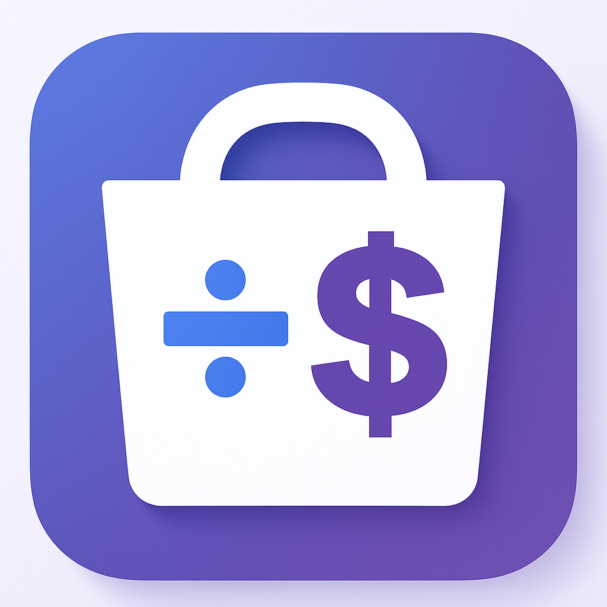

# 🛍️ Pack Saver - Find the Best Bulk Deals

<div align="center">



**Stop overpaying for bulk packs. See the real price with Pack Saver.**

[](https://chromewebstore.google.com/detail/pack-saver-find-best-bulk/ielgindoagjdlamfkpioiokokfdhpmge)
[](https://github.com/tamir-br/Pack-Saver)
[](./LICENSE)

**Version:** 1.0.0 | **Status:** ✅ Live on Chrome Web Store

</div>

---

## 📥 Download Now

### [👉 Get Pack Saver on Chrome Web Store 👈](https://chromewebstore.google.com/detail/pack-saver-find-best-bulk/ielgindoagjdlamfkpioiokokfdhpmge)

**Free • No tracking • Open source • Works offline**

---

## 🤔 The Problem

You're shopping for bulk items, and you see:
- "$6.99 for a 100-pack"
- "$15.99 for a 400-pack"

**Which is the better deal?** You'd have to pull out a calculator and do the math. Shopping sites intentionally sort by total price, not value.

Without doing tedious calculations, you'd never know that the "cheaper" pack is actually **60% more expensive per item** than the larger one.

---

## ✅ The Solution

**Pack Saver instantly calculates the price per item** for every bulk pack on the page. No more math. No more guesswork.

In seconds, you see which option genuinely saves you the most money.

---

## 🎯 What You Get

### 🏆 Best Deal Highlighted
A golden "Best Value" badge instantly points out the clear winner. No more guesswork.

### 💰 Price Per Item
See the real cost comparison for every product.

### 📊 Top 3 Deals Ranked
Quickly compare the three most cost-effective choices.

### ⚡ One-Click Navigation
Jump straight to the best-value item with a single click.

### 🔒 Privacy First
All calculations happen in your browser. Zero data collection. No tracking. Works completely offline.

---

## 🛒 Supported Platforms

Pack Saver works on all major shopping sites:

| Platform | Status | Link |
|----------|--------|------|
| **Amazon** | ✅ All regions | https://amazon.com |
| **Walmart** | ✅ US & Canada | https://walmart.com |
| **AliExpress** | ✅ All regions | https://aliexpress.com |
| **Temu** | ✅ Supported | https://temu.com |

More platforms coming soon! Have a suggestion? [Open an issue](https://github.com/tamir-br/Pack-Saver/issues)

---

## 🚀 How It Works

### Step 1: Browse Normally
Visit Amazon, Walmart, AliExpress, or Temu and search for bulk items.

### Step 2: Pack Saver Analyzes
The extension automatically scans all products on the page and calculates price per item.

### Step 3: Click to Jump
Click "Jump to Best Deal" to scroll directly to the best-value item.

### Step 4: Save Money
Buy the mathematically best option and save tens of percent!

---

## 📸 Screenshots

<div align="center">

**Before & After**


**Dashboard & Top Deals**


</div>

---

## 💡 Features

✨ **Smart Detection**
- Automatically detects bulk pack sizes
- Extracts prices from any layout
- Works on Amazon, Walmart, AliExpress, Temu

🎨 **Beautiful UI**
- Golden badges highlight best deals
- Draggable dashboard overlay
- Minimalist, non-intrusive design

⚡ **Performance**
- Fast analysis (under 1 second)
- Lightweight & efficient
- Works offline

🔒 **Privacy**
- Zero data collection
- No tracking pixels
- All math done locally
- Works completely offline

🎯 **Useful**
- Highlights best deal per item
- Shows top 3 options
- One-click jump to product
- Saves you money!

---

## 🔧 Installation

### Option 1: Chrome Web Store (Recommended)
[👉 Get Pack Saver on Chrome Web Store 👈](https://chromewebstore.google.com/detail/pack-saver-find-best-bulk/ielgindoagjdlamfkpioiokokfdhpmge)

**Fastest, easiest, and keeps you updated automatically.**

### Option 2: Manual Installation (Developers)

1. **Clone this repository:**
```bash
   git clone https://github.com/tamir-br/Pack-Saver.git
   cd Pack-Saver
```

2. **Load in Chrome:**
   - Open `chrome://extensions/`
   - Enable "Developer mode" (top right)
   - Click "Load unpacked"
   - Select this repository folder

3. **Done!** The extension is now active.

---

## 📂 Project Structure
```
Pack-Saver/
├── manifest.json          # Chrome extension configuration
├── content.js             # Main extension logic
├── background.js          # Service worker
├── popup.html             # Popup UI
├── popup.js               # Popup logic
├── styles.css             # All styling
├── icon16.png             # 16x16 icon
├── icon48.png             # 48x48 icon
├── icon128.png            # 128x128 icon
├── logo.png               # Main logo
├── README.md              # This file
├── LICENSE                # MIT License
└── docs/                  # Landing page
    └── index.html         # https://tamir-br.github.io/Pack-Saver/
```

---

## 🛠️ Development

### Setup
```bash
# Clone repo
git clone https://github.com/tamir-br/Pack-Saver.git
cd Pack-Saver

# Load in Chrome for testing
# 1. chrome://extensions/
# 2. Enable "Developer mode"
# 3. Click "Load unpacked"
# 4. Select this folder
```

### Key Files

| File | Purpose |
|------|---------|
| `manifest.json` | Extension configuration & permissions |
| `content.js` | Main price detection & analysis logic |
| `styles.css` | UI styling for badges & overlay |
| `popup.html/js` | Extension popup interface |
| `background.js` | Service worker for storage |

### Making Changes

1. Edit the files as needed
2. Go to `chrome://extensions/`
3. Click the refresh icon on Pack Saver
4. Test on a shopping site

---

## 🐛 Bug Reports & Features

Found a bug? Have a feature idea? Please open an issue!

### [👉 Open an Issue 👈](https://github.com/tamir-br/Pack-Saver/issues)

**Please include:**
- What shopping site you were on
- What products you were looking at
- What went wrong (or what you'd like)
- Screenshots if possible

---

## 🔐 Privacy Policy

**Pack Saver is privacy-first:**

✅ **NO data collection** - We don't store anything about you  
✅ **NO tracking** - No analytics, no pixels, no ads  
✅ **NO internet required** - Everything runs offline in your browser  
✅ **NO permissions needed** - Only needs to read shopping site pages  

Your shopping data stays on your device. Always.

---

## 📄 License

MIT License - See [LICENSE](./LICENSE) file for details

**TL;DR:** You can use this code however you want, commercially or personally, as long as you include the original license.

---

## 👤 Author

**Tamir Devlab**
- GitHub: [@tamir-br](https://github.com/tamir-br)
- Email: tamir.devlab@gmail.com
- Website: [Pack Saver Landing Page](https://tamir-br.github.io/Pack-Saver/)

---

## 🌟 Support This Project

Love Pack Saver? You can help by:

⭐ **Star this repository** on GitHub  
📝 **Leave a review** on [Chrome Web Store](https://chromewebstore.google.com/detail/pack-saver-find-best-bulk/ielgindoagjdlamfkpioiokokfdhpmge)  
🐛 **Report bugs** via [GitHub Issues](https://github.com/tamir-br/Pack-Saver/issues)  
💡 **Suggest features** via [GitHub Issues](https://github.com/tamir-br/Pack-Saver/issues)  
📢 **Share with friends** who love shopping deals  

---

## 📈 Changelog

### Version 1.0.0 (Oct 29, 2025) ✅ **NOW LIVE**
- ✅ Fixed unused permission issue
- ✅ Improved extension name
- ✅ Added homepage URL
- ✅ Rewrote description for clarity
- ✅ **Google approved! Available on Chrome Web Store**

---

## 🚀 What's Next?

Coming soon:
- 📍 More shopping platforms
- 🎯 Enhanced price detection
- 💾 Deal history & tracking
- 📊 Savings statistics
- 🔔 Price drop alerts

Have suggestions? [Open an issue](https://github.com/tamir-br/Pack-Saver/issues)!

---

## ⚖️ Disclaimer

Pack Saver is an unofficial tool and is not affiliated with Amazon, Walmart, AliExpress, Temu, or any shopping platform. It's designed to help you find better deals by calculating price per item from publicly displayed information.

Use at your own discretion.

---

<div align="center">

### 📥 Ready to Save Money?

## [👉 Download Pack Saver on Chrome Web Store 👈](https://chromewebstore.google.com/detail/pack-saver-find-best-bulk/ielgindoagjdlamfkpioiokokfdhpmge)

**Free • No tracking • Open source • Works offline**

---

**Made with ❤️ by [Tamir Devlab](https://github.com/tamir-br)**

</div>
```

---

## 📝 **How to Upload to GitHub**

### **Step 1:** Go to GitHub
```
https://github.com/tamir-br/Pack-Saver
